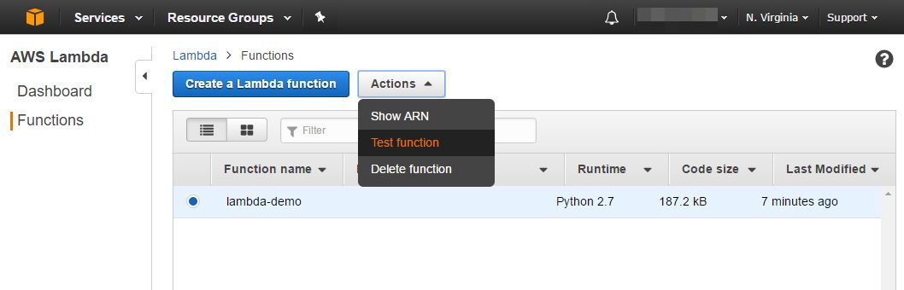
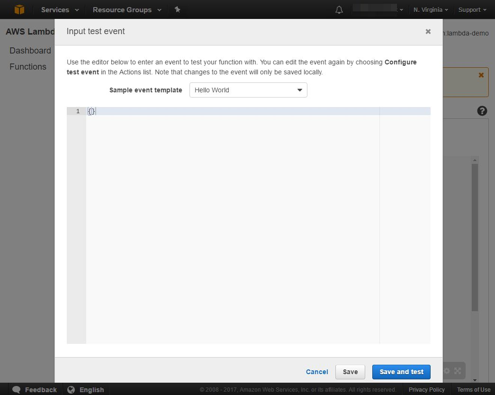
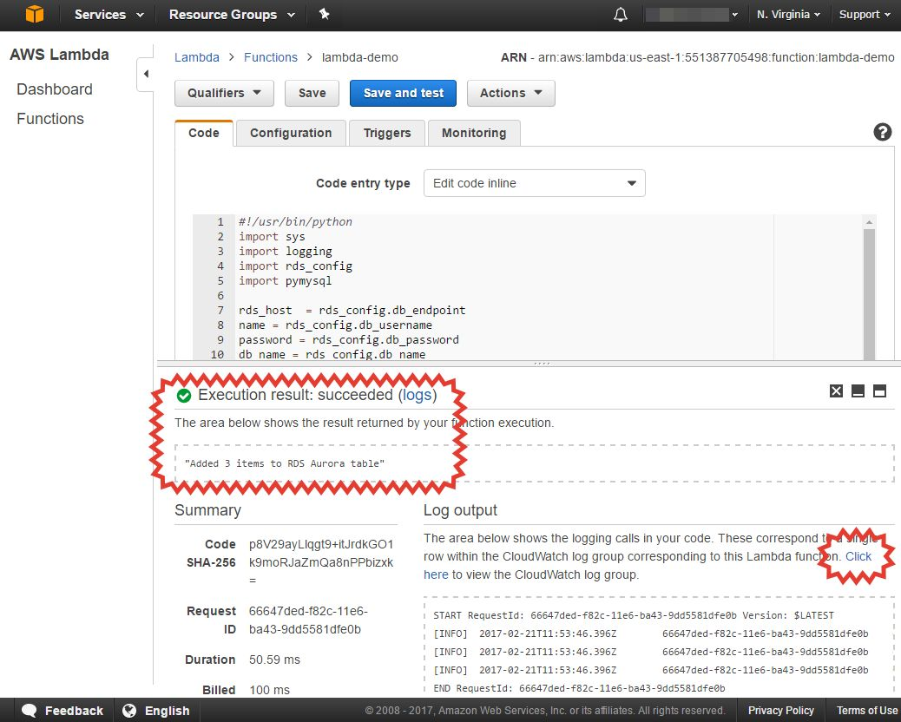

# AWS Lambda function example

This repo contains example of AWS lambda function interacting with AWS RDS Aurora cluster in VPC.
To create AWS resources used [Terrafom](http://terraform.io).

### TL;DR

```
1. Inspect 'params' file
2. Set environment variables with AWS credentials
   2.1. export
   2.2. export
3. Run 'manage' script to check waht AWS resources should be created
   3.1. ./manage plan
4. Run 'manage' script to deploy resources over AWS
   4.1. ./manage deploy
5. Test Lambda function 'lambda-demo' in AWS colnsole
6. Run 'manage' script to destroy resources
   6.1. ./manage destroy
```

### AWS resources

There is [manage](manage) Bash script used to create/destroy demo resources over AWS. Next resources will be created by running script:

- AWS VPC in specified region (configurable in [params](params) file
  - Two Subnets in VPC
  - Internet gateway for subnets
  - Route table with linked subnets pointed to Internet gateway as default route
  - Security group with ingress access only within VPC
- AWS RDS Aurora cluster
  - DB subnet group in VPC
  - Two RDS Aurora instances (`db.t2.medium`) joined in cluster
- AWS Lambda function `lambda-demo`
  - IAM role for Lambda function
  - IAM Role Policy for Lambda fucntion (used to allow Lambda have access resources in VPC)

### Lambda function source

**[Lambda-demo](lambda/lambda-demo.py)** is simple Python application that do:

- connect to Aurora RDS cluster
- drop table `Emploee3` if it exists
- create table `Emploee3`
- insert 3 rows in table (names `Joe`,`Bob`,`Mary`)

Source code placed in [lambda](lambda) directory (Python lib `pymysql` used)

For connecting to Aurora RDS cluster used file [rds_config.py](lambda/rds_config.py) created dinamically when `manage` script finished.
This file contains credentials and endpoint for Aurora cluster created in AWS.

### Important note

Aurora RDS resides in VPC. Lambda must have ability to run fucntions (create temporary instances) in VPC too. It managed
by configuring corresponding IAM Policy for lambda. Terrafrom code creates and destroys all necessary resources automatically.
You could inspect IAM polices in [tf/lambda.tf](https://github.com/pureclouds/lambda-aurora-example/blob/master/tf/lambda.tf#L26-L55) file.

### Testing Lambda function

You could test Lambda in AWS console:

#### Choose **Lambda** in console, select `lambda-demo` function and press 'Test function' in 'Actions' menu



#### Input blank test event and press 'Save and test' button



#### Inspect results and logs (in CloudWatch logs)



### Destroy demo resources

Do not forget destroyall  demo resources by `./manage destroy`
